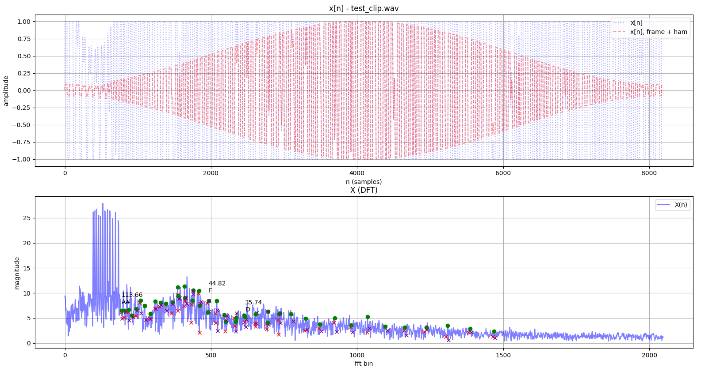
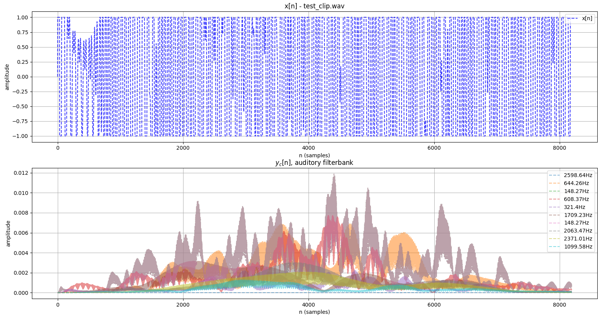
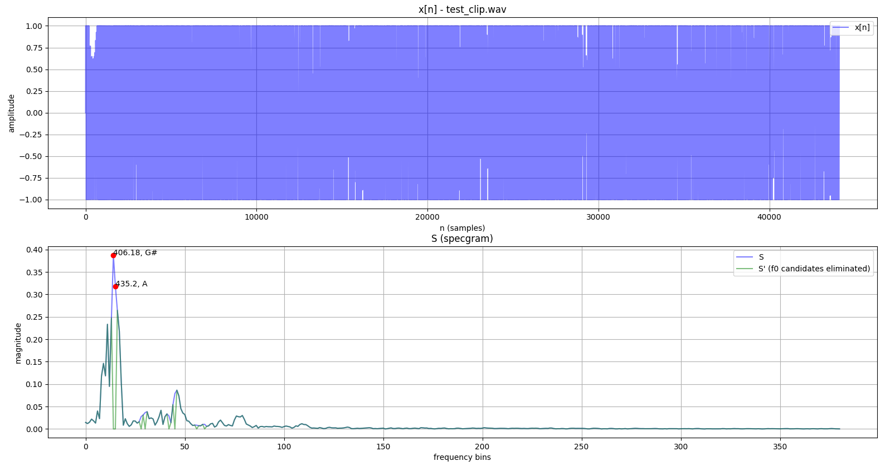

This repository is an MIT-licensed collection of multipitch/polyphonic instrument chord and key detection methods, implemented from academic papers using Python.

A chromagram and PCP (pitch class profile) are the same thing - an array of the 12 notes of Western music to describe a chord with some value (energy, etc.). Note that the float values of the chromagram in each method most likely represent different measures and units.

### Run instructions

Build and run the Docker container:

```
$ make docker_build
$ docker run chord-detection guitar-acoustic-gmaj7-chord.wav --method 2 --bitstring
Harmonic Energy (Stark, Plumbley)
001000100000
```

Run outside of Docker (e.g. for displaying matplotlib plots with `--displayplots`, running unittests with `python3.7 -m unittest`) by installing requirements.txt in Python 3.7.

### Methods

#### ESACF (Tolonen, Karjalainen)


_T. Tolonen and M. Karjalainen, "A computationally efficient multipitch analysis model," in IEEE Transactions on Speech and Audio Processing, vol. 8, no. 6, pp. 708-716, Nov. 2000._

_V. Zenz and A. Rauber, "Automatic Chord Detection Incorporating Beat and Key Detection," 2007 IEEE International Conference on Signal Processing and Communications, Dubai, 2007, pp. 1175-1178._

#### Harmonic Energy (Stark, Plumbley)



_M Stark, Adam and Plumbley, Mark., "Real-Time Chord Recognition for Live Performance," in Proceedings of the 2009 International Computer Music Conference (ICMC 2009), Montreal, Canada, 16-21 August 2009._

#### [INCOMPLETE] Iterative F0 (Klapuri, Anssi)



_Klapuri, Anssi, "Multipitch Analysis of Polyphonic Music and Speech Signals Using an Auditory Model," IEEE TRANSACTIONS ON AUDIO, SPEECH, AND LANGUAGE PROCESSING, VOL. 16, NO. 2, FEBRUARY 2008 255._

### Prime-multiF0 (Camacho, Kaver-Oreamuno)



_Camacho, A, Oreamuno, I, "A multipitch estimation algorithm based on fundamental frequencies and prime harmonics," Sound and Music Computing Conference 2013._


*N.B.* Doesn't perform great with instrument clips, but the paper only claims to perform well with generated sinewave + sawtooth clips, which my code agrees with in the unit tests.
