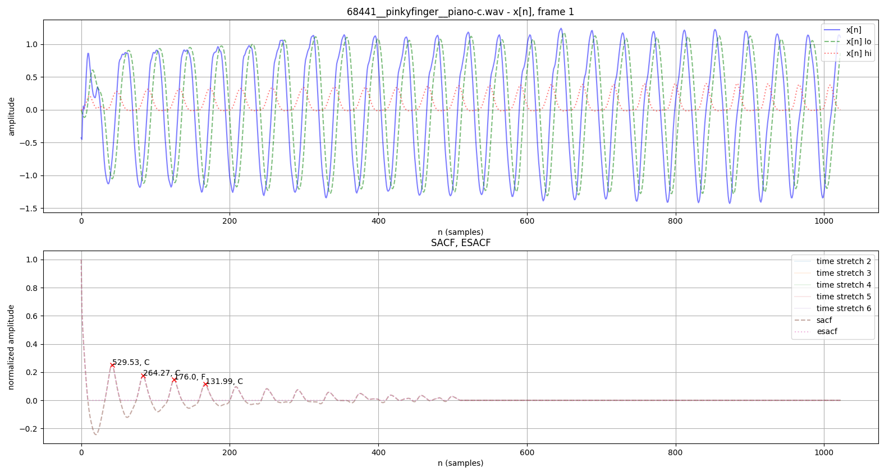
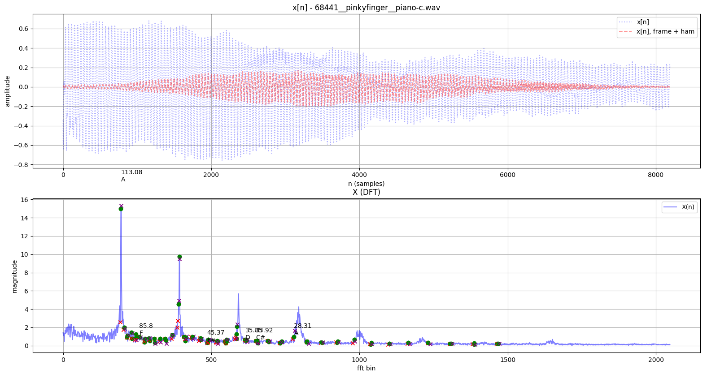
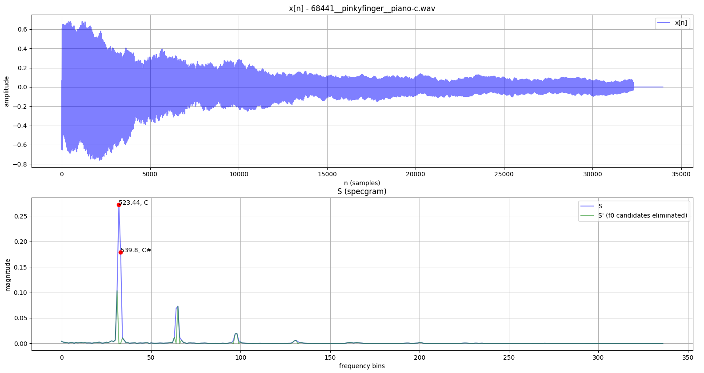

# chord-detection

This repository is an MIT-licensed collection of multipitch/polyphonic instrument chord and key detection methods, implemented from academic papers using Python.

## Usage

Pip install it from the git url: 
```
$ pip install git+https://github.com/sevagh/chord-detection.git
```

This installs the library `chord_detection` and the command-line tool `chord-detect`:
```
$ chord-detect
usage: chord-detection [-h] [--key] [--displayplots DISPLAYPLOTS] [--method METHOD] input_path
chord-detection: error: the following arguments are required: input_path
```

Run tests:
```
$ python ./tests/gen_test_clips.py
$ python -m unittest
```

## Methods

The results displayed come from a wav clip of a piano C major chord. The outputs are the summed chromagrams across all the frames, normalized to 9 (the biggest single-digit number), in a 12-digit chroma vector string.

The expected notes of a C major chord are C E G, so the expected answer should resemble `C000E00G0000`, where `C > E, C > G`. The values of C, E, G are specific to the method being used, but it's some representation of the energy of the detected pitch, e.g. spectral energy, summed FFT.

### ESACF (Tolonen, Karjalainen)

```
reference: C000E00G0000
computed:  900003001000, key: Cmaj
```



_T. Tolonen and M. Karjalainen, "A computationally efficient multipitch analysis model," in IEEE Transactions on Speech and Audio Processing, vol. 8, no. 6, pp. 708-716, Nov. 2000._

_V. Zenz and A. Rauber, "Automatic Chord Detection Incorporating Beat and Key Detection," 2007 IEEE International Conference on Signal Processing and Communications, Dubai, 2007, pp. 1175-1178._

### Harmonic Energy (Stark, Plumbley)

```
reference: C000E00G0000
computed:  921111111111, key: Cmin
```



_M Stark, Adam and Plumbley, Mark., "Real-Time Chord Recognition for Live Performance," in Proceedings of the 2009 International Computer Music Conference (ICMC 2009), Montreal, Canada, 16-21 August 2009._

### Iterative F0 (Klapuri, Anssi)

```
reference: C000E00G0000
computed:  900301000000, key: Cmin
```


_Klapuri, Anssi, "Multipitch Analysis of Polyphonic Music and Speech Signals Using an Auditory Model," IEEE TRANSACTIONS ON AUDIO, SPEECH, AND LANGUAGE PROCESSING, VOL. 16, NO. 2, FEBRUARY 2008 255._

_Klapuri, Anssi. "Multiple Fundamental Frequency Estimation by Summing Harmonic Amplitudes." ISMIR (2006)._

### Prime-multiF0 (Camacho, Kaver-Oreamuno)

```
reference: C000E00G0000
computed:  951000000002, key: Cmin
```



_Camacho, A, Oreamuno, I, "A multipitch estimation algorithm based on fundamental frequencies and prime harmonics," Sound and Music Computing Conference 2013._
