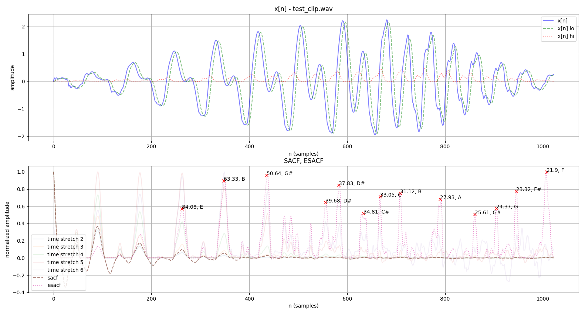

This repository is an MIT-licensed collection of multipitch/polyphonic instrument chord and key detection methods, implemented from academic papers using Python.

A chromagram and PCP (pitch class profile) are the same thing - an array of the 12 notes of Western music to describe a chord with some value (energy, etc.). Note that the float values of the chromagram in each method most likely represent different measures and units.

### Run instructions

Build and run the Docker container:

```
$ make docker_build
$ docker run chord-detection guitar-acoustic-gmaj7-chord.wav --method 2 --bitstring
Harmonic Energy (Stark, Plumbley)
001000100000
```

Run outside of Docker by installing requirements.txt:

```
shanssian:chord-detection $ python3.7 multipitch.py -h
usage: chord-detection [-h] [--key KEY] [--bitstring] [--displayplots]
                       [--method METHOD]
                       input_path

Collection of chord-detection techniques

positional arguments:
  input_path       Path to WAV audio clip

optional arguments:
  -h, --help       show this help message and exit
  --key KEY        estimate the key of input audio clip
  --bitstring      emit a 12-note chromagram bitstring
  --displayplots   display intermediate plots with matplotlib
  --method METHOD  choose the method (see the README)
```

### Methods

Use the list numbering (e.g. ESACF = 1) as values for the `--method` argument.

#### ESACF



_[1] T. Tolonen and M. Karjalainen, "A computationally efficient multipitch analysis model," in IEEE Transactions on Speech and Audio Processing, vol. 8, no. 6, pp. 708-716, Nov. 2000._

_[2] V. Zenz and A. Rauber, "Automatic Chord Detection Incorporating Beat and Key Detection," 2007 IEEE International Conference on Signal Processing and Communications, Dubai, 2007, pp. 1175-1178._

#### Harmonic energy chromagram ([3])


_[3] M Stark, Adam and Plumbley, Mark., "Real-Time Chord Recognition for Live Performance," in Proceedings of the 2009 International Computer Music Conference (ICMC 2009), Montreal, Canada, 16-21 August 2009._

#### Iterative F0 ([4])

_[4] Klapuri, Anssi, "Multipitch Analysis of Polyphonic Music and Speech Signals Using an Auditory Model," IEEE TRANSACTIONS ON AUDIO, SPEECH, AND LANGUAGE PROCESSING, VOL. 16, NO. 2, FEBRUARY 2008 255._
